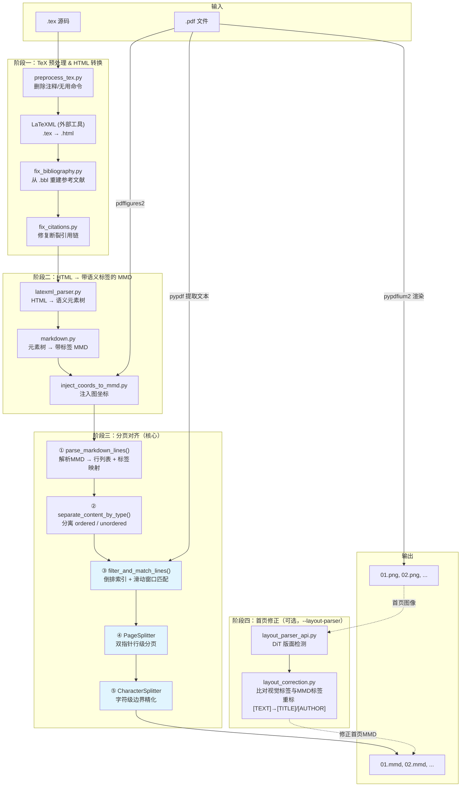
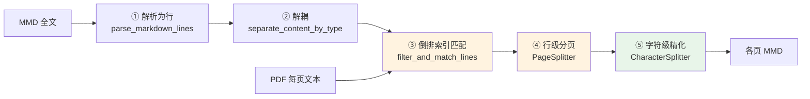
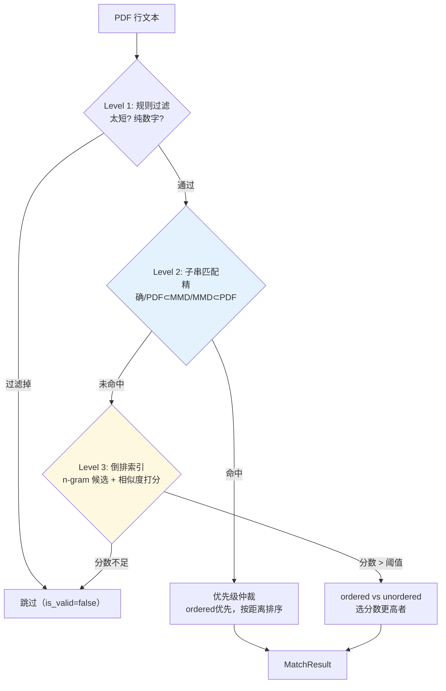
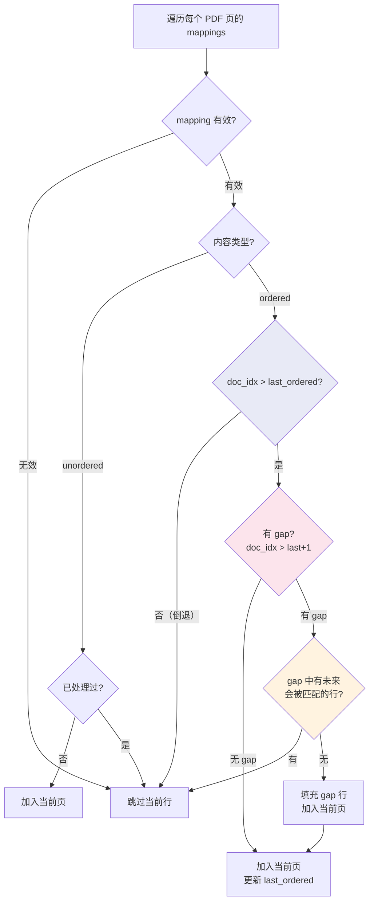
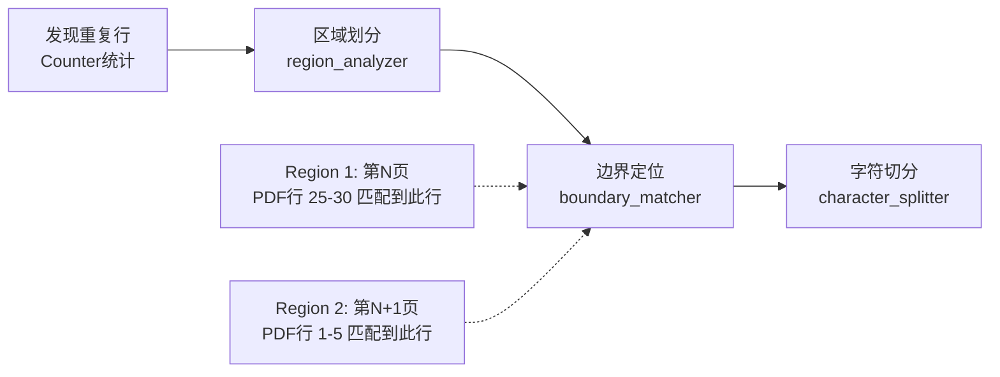
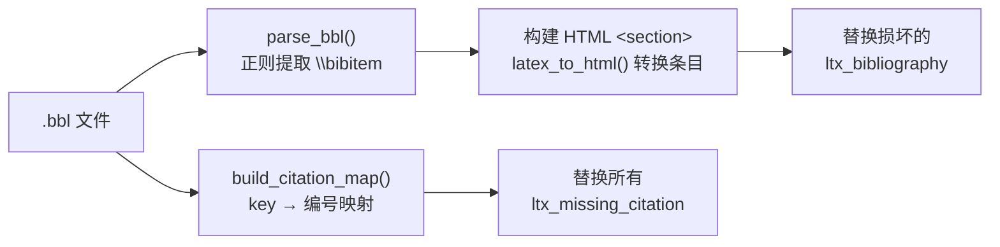
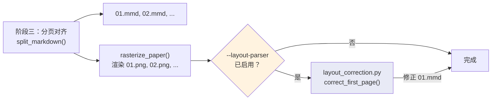

# Nougat-OCR 数据工程技术设计文档

> 面向端到端学术文档 OCR 模型的高质量训练数据集构建

---

## 一、项目背景与动机

### 1.1 端到端学术文档 OCR 的目标

学术文档 OCR 的终极目标是：给定一页 PDF 渲染图像，模型直接输出结构化的 Markdown 文本——不仅包含纯文字，还要正确还原公式、表格、图说、算法伪代码等多模态内容的语义结构。Meta 在 2023 年发布的 Nougat 模型验证了这一路线的可行性，但其训练数据存在两个核心缺陷：

1. **缺乏语义结构标注**：原版 Nougat 的 `.mmd` 训练标签是"扁平"的 Markdown，模型无法区分标题、正文、图说、脚注等不同内容类型。
2. **分页对齐粗糙**：原版依赖简单的启发式规则将连续 Markdown 切割到各页，对浮动元素（图/表/算法，下称 **TFA**）的页面归属处理不当。

本项目的目标是构建一条完整的数据处理流水线，解决上述两个问题，最终产出高质量的 **页级 `.mmd` / `.png` 训练对**。

### 1.2 为什么要自建流水线

arXiv 论文虽然提供 `.tex` 源码，但从 `.tex` 到 "按页对齐的结构化 Markdown" 之间没有现成工具可用。核心矛盾在于：

- **语义流 vs 视觉流的割裂**：`.tex` 是语义流——内容按逻辑顺序排列，浮动体由 LaTeX 排版引擎自动放置；PDF 是视觉流——内容按页面呈现位置排列。二者的内容顺序可能完全不同。
- 这意味着不能简单地把 Markdown 按字符数等分到各页——必须建立精确的 **语义行 ↔ PDF 视觉位置** 映射。

---

## 二、流水线总览

### 2.1 全局数据流

以下 Mermaid 图展示了从 `.tex` 源码到最终训练对的完整数据流：



### 2.2 各阶段输入输出速查表

| 阶段 | 输入 | 输出 | 核心工具/模块 |
|------|------|------|--------------|
| TeX 预处理 | `.tex` 源码 | 清洁化 `.tex` | `patches/preprocess_tex.py` |
| HTML 转换 | `.tex` | `.html` | LaTeXML（外部） |
| 引用修复 | `.html` + `.bbl` | 修复后 `.html` | `patches/fix_bibliography.py`, `fix_citations.py` |
| HTML → MMD | `.html` | 带语义标签的 `.mmd` | `parser/latexml_parser.py` → `parser/markdown.py` |
| 坐标注入 | `.mmd` + pdffigures2 JSON | 带坐标的 `.mmd` | `patches/inject_coords_to_mmd.py` |
| **分页对齐** | `.mmd` + `.pdf` | 每页 `.mmd` + `.png` | `split_md_to_pages.py` + `split_utils/*` |
| 首页修正（可选） | 首页 `.png` + 首页 `.mmd` | 重标后首页 `.mmd` | `nougat/dataset/layout_correction.py` → `layout_parser/` |

### 2.3 主入口代码

`split_htmls_to_pages.py` 中的 `process_paper()` 将上述阶段串联：

```python
# split_htmls_to_pages.py: process_paper() 核心流程
doc = parse_latexml(html)                          # HTML → 语义元素树
mmd_text, _ = format_document(doc, keep_refs=True)  # 元素树 → 带标签的 MMD
mmd_text = inject_coordinates(mmd_text, ...)        # 注入图坐标
doc_text_by_pages, bad_page_indices = split_markdown(  # 分页对齐
    doc=mmd_text, pdf=pdf, figure_info=figure_info
)
rasterize_paper(pdf_file, outpath, pages=recognized_indices)  # 渲染 PNG
```

最终产出目录结构：

```
output/paper_id/
├── 01.mmd    # 第 1 页的结构化 Markdown
├── 01.png    # 第 1 页的 PDF 渲染图像
├── 02.mmd
├── 02.png
└── ...
```

### 2.4 与原版 Nougat 的贡献边界

| 模块 | 原版 Nougat | 本项目贡献 |
|------|------------|-----------|
| `parser/document.py` | 基础元素树框架 | 新增 `Algorithm` 类，修改 `Table` 以支持 caption |
| `parser/latexml_parser.py` | HTML 解析骨架 | 深度修改：算法环境检测、caption 标签注入、引用处理 |
| `parser/markdown.py` | 基础 Markdown 格式化 | 重写：全套语义标签生成 |
| `split_utils/` (11 个文件) | **不存在** | **完全新增**——分页算法全部实现 |
| `split_md_to_pages.py` | 极简原版分页 | **完全重写** |
| `split_htmls_to_pages.py` | 原版处理入口 | **重写**——新 API、坐标注入集成 |
| `patches/` (5 个文件) | **不存在** | **完全新增** |
| `layout_parser/` | **不存在** | **完全新增**——DiT 版面检测首页修正 |
| `rasterize.py`, `pdffigures.py` | 原版工具 | 小幅适配 |

---

## 三、核心模块详解

### 3.1 分页算法——语义流与视觉流的对齐

这是本项目最核心的工程贡献。分页算法解决的问题一句话概括：**将一篇连续的 `.mmd` 文档按 PDF 每页的视觉范围精确切分，使每段 `.mmd` 内容恰好对应其所在的 PDF 页面图像。**

#### 3.1.1 总体架构与五步流程

分页算法在 `split_md_to_pages.py` 的 `split_markdown()` 中编排：



对应代码：

```python
# split_md_to_pages.py — 分页流水线编排
def split_markdown(doc, pdf, figure_info):
    doc_lines, text_obj_map, line_tag_map = parse_markdown_lines(doc)
    ordered_lines, unordered_lines = separate_content_by_type(doc_lines, line_tag_map)
    valid_lines_of_pages, index_mappings = filter_and_match_lines(
        pdf, ordered_lines, unordered_lines
    )
    page_splitter = PageSplitter(doc_lines, line_tag_map)
    doc_pages, valid_index_mappings = page_splitter.split_markdown_pages(index_mappings)
    refined_pages, split_lines = split_characters_in_pages(
        doc_lines, doc_pages, valid_index_mappings
    )
```

#### 3.1.2 Step ①②：解析与 Ordered/Unordered 解耦

**设计动机**：在 PDF 中，正文段落按阅读顺序从上到下排列（单调递增），但图表（TFA）是浮动体——LaTeX 的排版引擎会把它们"飘"到页面顶部或底部。这意味着：

- 正文第 15 段在 PDF 第 3 页，第 16 段也在第 3 页——它们的顺序是**确定的**。
- 但 Figure 3 在 `.tex` 中写在第 15 段之后，在 PDF 中却可能出现在第 5 页——它的位置是**不确定的**。

如果不区分二者，滑动窗口匹配时一旦遇到 TFA 的"乱序"映射，会破坏正文的递增假设，导致大量误匹配。

`build_line_tag_mapping()` 是分类的入口：

```python
# markdown_parser.py — 标签分类规则
tag_types = {
    'TEXT':            {'content_type': 'ordered'},     # 正文
    'TITLE':           {'content_type': 'ordered'},     # 论文标题
    'SUBTITLE':        {'content_type': 'ordered'},     # 章节标题
    'AUTHOR':          {'content_type': 'ordered'},     # 作者信息
    'FORMULA':         {'content_type': 'ordered'},     # 公式
    'FIGURE_TITLE':    {'content_type': 'unordered'},   # 图标题（浮动）
    'TABLE_TITLE':     {'content_type': 'unordered'},   # 表标题（浮动）
    'ALGORITHM_TITLE': {'content_type': 'unordered'},   # 算法标题（浮动）
    'FOOTNOTE':        {'content_type': 'unordered'},   # 脚注
}
```

**TFA 折叠/展开机制**：进入分页前，`replace_tfa_with_titles()` 将完整的 TFA 块折叠为仅保留标题行，存入 `text_obj_map`。分页完成后通过映射表还原完整内容。这避免了表格 LaTeX 代码等噪声干扰匹配。

> **实例——解析后的 MMD 行（来自论文 2303.00058）**：
>
> | 行号 | 标签类型 | 内容类型 | 内容（截取） |
> |-----|---------|---------|------------|
> | 0 | TITLE | ordered | `[TITLE]# Neural Nonnegative Matrix Factor...` |
> | 1 | AUTHOR | ordered | `[AUTHOR]Tyler Will, Runyu Zhang, ...` |
> | 2 | SUBTITLE | ordered | `[SUBTITLE]###### Abstract.[END_SUBTITLE]` |
> | 3 | TEXT | ordered | `We introduce a new method based on...` |
> | 5 | SUBTITLE | ordered | `[SUBTITLE]## 1. Introduction[END_SUBTITLE]` |
> | 4 | FOOTNOTE | **unordered** | `[FOOTNOTE:1]DN, JH, ES, JV...` |

#### 3.1.3 Step ③：倒排索引匹配——建立 PDF 行 → MMD 行映射

匹配器的目标：对 PDF 每一页的每一行文本，找到它在 `.mmd` 中对应的行。

**双重倒排索引**：`LineMatcher` 维护 ordered 索引和 unordered 索引两套独立体系：

```python
# line_matcher.py — 双重倒排索引初始化
class LineMatcher:
    def __init__(self, ordered_lines, unordered_lines, window_size=10):
        ordered_text_lines = [line.content for line in ordered_lines]
        self.ordered_inverted_index = InvertedIndexBuilder.build_inverted_index(
            ordered_text_lines
        )
        unordered_text_lines = [line.content for line in unordered_lines]
        self.unordered_inverted_index = InvertedIndexBuilder.build_inverted_index(
            unordered_text_lines
        )
```

**索引构建**：对每行文本使用 jieba 分词，构建 2-gram/3-gram 词组作为索引 key，值为该行在 ordered_lines（或 unordered_lines）中的 **局部下标** `local_index`（非原始全文行号，原因见 4.2 节）。

**单行匹配的三级策略**：



**滑动窗口机制**：匹配器通过 `current_ordered_pointer` 跟踪当前已匹配到的 ordered 位置。窗口 `[pointer - window_size, pointer + window_size]` 限制候选范围：

```python
# line_matcher.py — 窗口过滤
windowed_candidates = [
    idx for idx in candidates
    if context.current_ordered_pointer <= idx
    and idx <= context.current_ordered_pointer + self.window_size
]
```

**公式编码**：`markdown_encoder.py` 在匹配前将 MMD 中的 LaTeX 公式转换为 Unicode 字符（如 `\alpha` → `α`、`\sum` → `∑`），消除 PDF 渲染文本与 LaTeX 源码之间的表示差异。

> **实例——`index_mappings` 的一页匹配结果（论文 2303.00058 第 0 页）**：
>
> | PDF行# | PDF 行内容（截取） | → MMD行# | 匹配类型 | 分数 |
> |--------|-----------------|---------|---------|------|
> | 0 | `neural nonnegative matrix factorization for hierarchical multilayer topic` | 0 | single_line_substring | 1.0 |
> | 1 | `modeling` | — | *(太短，过滤)* | — |
> | 2 | `tyler will, runyu zhang, eli sadovnik, mengdi gao, joshua vendrow...` | 1 | single_line_substring | 1.0 |
> | 3 | `denali molitor, and deanna needell` | 1 | dual_inverted | 0.85 |
> | 4 | `abstract . we introduce a new method based on nonnegative matrix...` | 3 | single_line_substring | 1.0 |
> | 5 | `detecting latent hierarchical structure in data. datasets with...` | 3 | dual_inverted | 0.86 |
>
> 注意：PDF 行 0 和行 4-5 分别匹配到 MMD 行 0 和 3——多个 PDF 行可以映射到同一个 MMD 行（因为 PDF 按视觉换行，MMD 是逻辑段落）。行 1 "modeling" 因太短被过滤。

#### 3.1.4 Step ④：双指针行级分页

`PageSplitter` 拿到 `index_mappings` 后，用双指针扫描将 MMD 行分配到各页：



核心数据结构与原则：

```python
# page_splitter.py — 全局状态
processed_ordered_set = set()    # 已分配的 ordered 行（全局去重）
processed_unordered_set = set()  # 已分配的 unordered 行（全局去重）
current_ordered_pointer = -1     # ordered 指针，只能前进
```

1. **Ordered 行严格递增**：`doc_line_idx > last_ordered_in_page` 时才接受。
2. **Unordered 行独立去重**：不受递增约束，先到先得。
3. **Gap 填充**：通过 `matched_doc_lines_set`（预言机）判断 gap 行是否将来会被匹配。

> **实例——行级分页结果（论文 2303.00058 第 0 页）**：
>
> ```
> Page 0 (is_valid=true):
>   doc_lines = [0, 1, 2, 3, 3, 5, 6, 4]
>                ↑     ↑        ↑     ↑
>              TITLE  AUTHOR  SUBTITLE FOOTNOTE(unordered)
> ```
> 注意行 3 出现两次（跨页行，将在字符级精化时处理），行 4 是 FOOTNOTE（unordered）被放在 ordered 行之后。

#### 3.1.5 Step ⑤：字符级边界精化——处理跨页行

行级分页后，某些 MMD 行的前半段出现在第 N 页底部、后半段出现在第 N+1 页顶部——这需要字符级精确切分。



**触发条件**：某个 `doc_line_index` 出现在两个或以上 `PageResult.doc_lines_by_page` 中。

**区域划分**（`region_analyzer.py`）：以"跨页"或"unordered 内容插入"为分界，将同一行的多次 PDF 匹配划分为连续 `ContinuousRegion`。

**边界定位**（`boundary_matcher.py` + `string_matcher.py`）：取相邻 region 边界处的 PDF 行文本，在 MMD 行中做字符级定位。使用 trigram 部分匹配表 + 容错跳跃（最多 3 字符 gap）的算法。对区域末尾使用**双向匹配**取 `end_pos` 更大者：

```python
# boundary_matcher.py — 双向匹配
if boundary_type == "last":
    match_result = find_match_positions(
        content=content.lower(), query=query.lower(),
        bidirectional_match=True  # 正向 + 反向取 end_pos 更靠后者
    )
```

> **实例——字符级边界匹配（论文 2303.00058 MMD行 6，4237 字符长段落跨页 0→1）**：
>
> ```
> 行内容："As the size of available data continues to grow, scalable
>         approaches for extracting meaningful latent trends..."
>         ...共 4237 个字符...
>
> Region 1 (page 0) 末尾 PDF行：
>   "cally provide a hierarchical representation of how topics
>    at finer granularity relate to topics at courser"
>   → 匹配到 MMD 位置 [2401, 2506]
>
> Region 2 (page 1) 首行 PDF行：
>   "granularity, while avoiding the often high approximation
>    error of naive application of HNMF. An ad"
>   → 匹配到 MMD 位置 [2508, 2605]
>
> Gap 分析: position 2507 为一个空格 → 完美切分点
> 结果: 前 2507 字符 → 第 0 页，后续字符 → 第 1 页
> ```

---

### 3.2 语义标签体系

#### 3.2.1 标签种类与层级

| 标签 | 含义 | 内容类型 | 示例 |
|------|------|---------|------|
| `[TITLE]...[END_TITLE]` | 论文标题 | ordered | `[TITLE]# Attention Is All You Need[END_TITLE]` |
| `[AUTHOR]...[END_AUTHOR]` | 作者信息 | ordered | `[AUTHOR]Ashish Vaswani ...[END_AUTHOR]` |
| `[SUBTITLE]...[END_SUBTITLE]` | 章节标题 | ordered | `[SUBTITLE]## 3 Model Architecture[END_SUBTITLE]` |
| `[TEXT]...[END_TEXT]` | 正文段落 | ordered | `[TEXT]The dominant sequence...[END_TEXT]` |
| `[FORMULA]...[END_FORMULA]` | 行间公式 | ordered | `[FORMULA]\[E = mc^2\][END_FORMULA]` |
| `[FIGURE]...[END_FIGURE]` | 图及其内容 | — | 完整图块（含标题、坐标） |
| `[FIGURE_TITLE]...[END_FIGURE_TITLE]` | 图标题 | unordered | TFA 折叠后的匹配标识 |
| `[TABLE]...[END_TABLE]` | 表及其内容 | — | 完整表块（含 LaTeX tabular） |
| `[TABLE_TITLE]...[END_TABLE_TITLE]` | 表标题 | unordered | TFA 折叠后的匹配标识 |
| `[ALGORITHM]...[END_ALGORITHM]` | 算法伪代码 | — | 含 code block 的算法块 |
| `[ALGORITHM_TITLE]...[END_ALGORITHM_TITLE]` | 算法标题 | unordered | TFA 折叠后的匹配标识 |
| `[FOOTNOTE:id]...[END_FOOTNOTE]` | 脚注 | unordered | `[FOOTNOTE:1]1 Equal contribution[END_FOOTNOTE]` |
| `[FIGURE_COORDS]...[END_FIGURE_COORDS]` | 图坐标 | — | 归一化 bounding box |

#### 3.2.2 标签生成时机

标签在 HTML → MMD 转换阶段注入。以 caption 为例，`latexml_parser.py` 在解析时根据父元素类型注入不同子标签：

```python
# latexml_parser.py — Caption 标签注入
elif sv.match(".ltx_float_caption, .ltx_caption", child):
    parent_elem = parent.find_parent((Figure, Table, Algorithm))
    if isinstance(parent_elem, Figure):
        parent_elem.caption.append(TextElement(content="[FIGURE_TITLE]"))
        parse_latexml_children(child, parent_elem.caption)
        parent_elem.caption.append(TextElement(content="[END_FIGURE_TITLE]\n\n"))
```

原版 Nougat 不识别算法环境。本项目在 `document.py` 新增 `Algorithm` 类，在 `latexml_parser.py` 中通过 `ltx_listing` / `ltx_float_algorithm` CSS 类检测算法容器：

```python
# latexml_parser.py — 算法环境检测
elif sv.match("figure.ltx_figure", child) or sv.match("span.ltx_figure", child):
    is_algorithm = child.find(class_="ltx_listing") is not None
    if is_algorithm:
        figure = parent.append(Algorithm())
    else:
        figure = parent.append(Figure())
```

---

### 3.3 Patches 系列——修复 LaTeXML 的不足

#### 3.3.1 参考文献修复

**问题**：LaTeXML 处理 `babel` 等宏包时引用链断裂——文中 `\cite{key}` 变成 `<span class="ltx_missing_citation">`，参考文献列表可能为空。

**修复**分两步：



`latex_to_html.py` 使用栈匹配算法处理嵌套 LaTeX 命令（`\emph{}`、`\sc{}`、`\url{}`）。

#### 3.3.2 图坐标注入

`inject_coords_to_mmd.py` 将 pdffigures2 提取的图表位置归一化后注入 MMD。坐标做了 PDF→图像坐标系转换（y 轴翻转）：

```python
# inject_coords_to_mmd.py — 坐标归一化
def normalize_coords(coords, page_width, page_height):
    x1, y1, x2, y2 = coords
    return [
        round(x1 / page_width, 4),
        round(1 - y2 / page_height, 4),  # y 轴翻转
        round(x2 / page_width, 4),
        round(1 - y1 / page_height, 4),
    ]
```

注入时还判断 caption 在图片上方还是下方，决定 `[FIGURE_COORDS]` 的插入位置。

---

### 3.4 Layout Parser——基于视觉检测的首页标签修正

#### 3.4.1 动机

学术论文的首页结构高度异构：标题、作者、摘要、脚注等元素在不同模板中的排列方式差异极大。LaTeXML 的语义解析对某些模板适配不佳（如 `\maketitle` 缺失、非标准 frontmatter），导致首页 MMD 的**文字内容正确，但语义标签缺失**——即标题文本被标为 `[TEXT]` 而非 `[TITLE]`。

本模块引入一个基于 **DiT（Document Image Transformer）** 的版面检测模型，从 PDF 首页渲染图像直接检测各布局元素的类别和位置，为首页 MMD 标签提供"视觉真值"参照，并**自动将误标为 `[TEXT]` 的内容重标为正确的语义标签**。

#### 3.4.2 与主流水线的集成点

Layout Parser 修正**不是**独立的离散补丁，而是嵌入在 `split_htmls_to_pages.py` 的 `process_paper()` 函数中、分页完成后立即执行的可选步骤：



调用链：
1. `split_htmls_to_pages.py` 的 `process_paper()` 完成分页 + PNG 渲染
2. 若 `--layout-parser` 已启用，且首页（`0 in recognized_indices`）成功处理：
3. 读取 `out/paper_id/01.mmd` 和 `out/paper_id/01.png`
4. 调用 `nougat/dataset/layout_correction.py` → `try_correct_first_page()`
5. 内部通过 `layout_parser/layout_parser_api.py` 对 01.png 做 DiT 检测
6. 比对视觉检测标签与 MMD 已有标签，修正后写回 `01.mmd`

```python
# split_htmls_to_pages.py — process_paper() 中的集成钩子
if getattr(args, "layout_parser", False) and 0 in recognized_indices:
    first_page_img = outpath / "01.png"
    first_page_mmd = outpath / "01.mmd"
    if first_page_img.exists() and first_page_mmd.exists():
        from nougat.dataset.layout_correction import try_correct_first_page
        original = first_page_mmd.read_text(encoding="utf-8")
        corrected = try_correct_first_page(original, str(first_page_img))
        if corrected != original:
            first_page_mmd.write_text(corrected, encoding="utf-8")
```

#### 3.4.3 修正逻辑：不注入文本，只重标标签

**原始设计**（来自 `pdf_parser/TitleAuthorDetector`）：
- 对每个 PDF 的前 N 页（`max_depth`）做版面检测，找到"标题作者页"
- 用 OCR 从裁剪的 bbox 区域提取标题/作者文本，返回 `{title: [...], author: [...]}`

**当前集成到 Nougat 流水线后的简化**：
- 我们**已经有**正确的文字内容（来自 LaTeXML → MMD），**不需要** OCR 重新提取
- 问题仅仅是：标签可能缺失（`[TEXT]` 应为 `[TITLE]`）
- 所以修正操作是 **retag**（重标），不是 inject（注入）：

```python
# layout_correction.py — 核心修正逻辑
# 1. DiT 在 01.png 上检测到 "文章标题" bbox
# 2. 检查 01.mmd 中是否已有 [TITLE] 标签
# 3. 若无：找到第一个 [TEXT]...[END_TEXT]，重标为 [TITLE]...[END_TITLE]
#    文本内容完全不变，只改外层标签包裹

if "TITLE" in visual_tags and "TITLE" not in mmd_tags:
    corrected = _retag_first_matching_text(corrected, "TITLE")

if "AUTHOR" in visual_tags and "AUTHOR" not in mmd_tags:
    corrected = _retag_first_matching_text(corrected, "AUTHOR", after_tag="TITLE")
```

这避免了文本重复问题——不会出现"注入 TITLE 后跟原来的 TEXT 造成内容重复"。

#### 3.4.4 检测类别体系

DiT 模型支持 **20 类**版面元素（定义于 `layout_parser/cls_idx2name.json`）：

| 编号 | 中文名 | 英文名 | 编号 | 中文名 | 英文名 |
|------|--------|--------|------|--------|--------|
| 1 | 文章标题 | title | 11 | 算法 | algorithm |
| 2 | 作者 | author | 12 | 参考文献 | reference |
| 3 | 正文 | text | 13 | 片段 | segment |
| 4 | 子标题 | subtitle | 14 | 表格注释 | table_note |
| 5 | 表格 | table | 15 | 目录 | catalog |
| 6 | 表格标题 | table_title | 16 | 出处 | source |
| 7 | 图片 | figure | 17 | 其他 | others |
| 8 | 图片标题 | figure_title | 18 | 副标题 | assistant_title |
| 9 | 注释 | bottom_note | 19 | 日期编号 | date |
| 10 | 公式 | formula | 20 | 公式推导 | derivation |

其中 `VISUAL_LABEL_TO_MMD_TAG` 映射 13 类到 MMD 标签（中英文名均可匹配）。但**当前默认仅 TITLE 和 AUTHOR 触发自动修正**（`CORRECTABLE_TAGS = {"TITLE", "AUTHOR"}`），可通过调用参数扩展。

#### 3.4.5 模型与路径配置

| 配置项 | 说明 | 默认值 |
|--------|------|--------|
| **模型权重** | Cascade R-CNN + DiT backbone | `layout_parser/model_final.pth`（或 `LAYOUT_PARSER_MODEL_PATH` 环境变量） |
| **模型配置** | Detectron2 YAML | `layout_parser/sjt_configs/cascade/cascade_dit_base.yaml` |
| **类别映射** | 20 类定义 | `layout_parser/cls_idx2name.json` |
| **字体文件** | 可视化标注用（可选） | 系统 `simsun.ttc`，缺失时 fallback 到默认字体 |

所有路径均为相对路径或可通过环境变量覆盖，不依赖硬编码绝对路径。

---

## 四、设计难点与解决方案

### 4.1 为什么 Ordered 与 Unordered 必须解耦？

**根本原因**：滑动窗口匹配依赖 **ordered 内容单调递增** 的假设。

**不解耦的后果**：假设 MMD 中正文行 50 和行 51 之间夹着 Figure 5 标题（假设原始行号 80），而 Figure 5 在 PDF 第 8 页。当算法在第 3 页匹配到行 50 后指针指向 50。如果不解耦，第 8 页匹配到 Figure 5 时指针跳到 80，之后匹配行 51 时 `51 < 80`，窗口判断会将其排除——正文匹配链彻底断裂。

解耦后，ordered 和 unordered 各自维护独立的局部编号和倒排索引，互不干扰。

### 4.2 倒排索引的值为什么是局部下标而非全文行号？

这是为了让窗口限制 `[pointer, pointer + window_size]` 语义正确。

用全文行号时：假设 ordered 行在全文中的行号是 `[2, 5, 8, 12, 15, ...]`（中间穿插 unordered 行），窗口大小 5。指针在行 5 时窗口 `[5, 10]`，但行 12 虽然只是**紧挨**的下一个 ordered 行，却被排除。

用局部下标后：同样的 ordered 行编号为 `[0, 1, 2, 3, 4, ...]`，窗口 `[1, 6]` 正好覆盖相邻 5 个 ordered 行——这才是 `window_size` 的真正语义。

### 4.3 双指针如何处理异常情况？

| 异常场景 | 处理策略 |
|---------|---------|
| **PDF 行匹配不到任何 MMD 行** | 跳过。页眉/页码/水印等在 MMD 中不存在 |
| **匹配跳跃过远（gap）** | 检查 gap 中是否有"将来会被匹配"的 ordered 行。有则跳过当前匹配；无则填充 gap 行到当前页 |
| **Unordered 打断 ordered** | 解耦机制保证 `last_ordered_in_page` 只跟踪 ordered 行，unordered 行不影响递增约束 |
| **页面起始处出现 gap 填充** | 标记涉及的两页为 `is_valid=False`，不纳入训练集（保守丢弃） |

### 4.4 TFA 标签的"放回"问题

**位置不一致的根因**：LaTeX 浮动体机制（`\begin{figure}[htbp]`）允许排版引擎自动放置图表。`.tex → .html` 保留原始写作顺序，PDF 则呈现排版后的视觉顺序。

**解决方案**：TFA 页面归属完全由 **PDF 匹配** 决定：
1. TFA 标题参与 unordered 索引匹配，由 PDF 中的实际位置定位。
2. `processed_unordered_set` 保证每个 TFA 只分配到一个页面。
3. 分页完成后通过 `text_obj_map` 将折叠标题还原为完整 TFA 块。

### 4.5 字符级边界分割的触发条件与算法

**触发条件**：某 MMD 行出现在 ≥2 个 `PageResult.doc_lines_by_page` 中（跨页行）。

**算法**：
1. 在 `index_mappings` 中找该行的所有匹配，按 **跨页** 或 **unordered 插入** 分割为 `ContinuousRegion`。
2. 取相邻 region 边界处的 PDF 行文本，做字符级定位（`find_match_positions`，trigram 表 + 容错跳跃）。
3. 对区域末尾用正向+反向双向匹配，取 `end_pos` 更靠后者（最大化前一页覆盖）。
4. 根据边界位置将 MMD 行切分为多个 `CharacterSegment`。

> 实例中的 gap 分析表明，大多数切分点恰好落在词边界或空格处，分割质量良好。

---

## 五、已知局限与未竟工作

### 5.1 当前局限

1. **PDF 文本提取质量瓶颈**：`pypdf` 对某些 PDF（扫描件、特殊字体）效果不佳。复杂公式行的 PDF 提取结果与 MMD Unicode 编码差异较大。
2. **双栏排版处理不完善**：`pypdf` 提取双栏 PDF 时可能交错两栏内容。当前通过较大 `window_size=20` 缓解，非根本方案。
3. **冲突页面保守丢弃**：边界模糊的相邻页面被标记无效并丢弃，损失部分训练数据。
4. **TFA 匹配失败**：标题被截断或跨栏时匹配失败，该 TFA 缺失。
5. **参考文献修复覆盖范围**：仅支持标准 `\bibitem` 格式，对 `biblatex` 支持有限。

### 5.2 数据工程产出

流水线最终跑通，产出约 **82,813 对** `.mmd` / `.png` 训练样本。

### 5.3 未竟工作

1. **模型训练**：数据工程已完成，端到端 OCR 模型训练尚未启动。训练框架（`train.py`, `lightning_module.py`）沿用原版 Nougat。
2. **Layout Parser 修正类别扩展**：当前仅自动修正 TITLE 和 AUTHOR 两类标签。可通过扩展 `CORRECTABLE_TAGS` 支持更多类别（如 ABSTRACT、SECTION），但需要验证误修正率。
3. **评估体系**：缺乏自动化分页质量评估指标，依赖人工抽检。
4. **增量处理**：当前为全量批处理，未实现增量更新。
